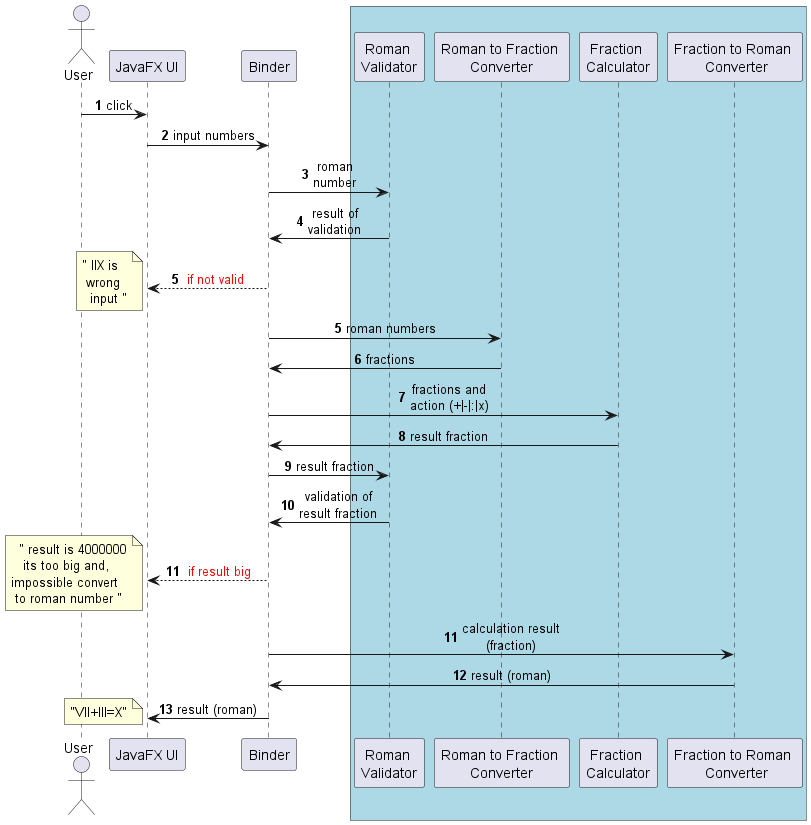

# Калькулятор для древних римлян

## Описание:
1) Программа оперирует римскими числами (как целыми, так и римскими дробями), позволяет их складывать, вычитать, делить и умножать.
2) При вводе каждой цифры, программа проверяет число на совпадение с правилами записи римских чисел.
3) Калькулятор дает ответы в диапазоне от 1 до 3999999 для целых чисел и от 1/1728 до 1727/1728 для дробной части чисел.
4) В нижней части окна программы располагаются случайные древнеримские цитаты на латыни с переводом. Их можно менять кнопкой "↓".
## Как запустить:
1) Для запуска программы, необходима установленная Java версии 19 или выше.
2) Исполняемый jar-файл лежит в папке out.
## Технологии:
Программа написана на Java 19 с использованием следующих библиотек:
1) JavaFX19 (для написания UI)
2) Junit5, AssertJ, Mockito (для тестирования)
## Что нужно для сборки jar-файла:
1) Скачать javaFX SDK: https://gluonhq.com/products/javafx/
2) Следовать инструкции на видео: https://www.youtube.com/watch?v=NbJWsfnTETw
## Правила записи римских чисел:
1) В римской системе счисления нет нуля. Ноль может быть ответом и записывается как nulla, но операции с нулем невозможны.
2) Римская система счисления не позиционна и в ней нет цифр для записи целых чисел больше чем 3999999.
3) В римской системе счисления нет десятичных дробей, вместо этого в ней используются половины (S = 1/2), унции (• = 1/12) и меньшие дроби, кратные унции.
4) Натуральные числа записываются при помощи повторения цифр. При этом, если бо́льшая цифра стоит перед меньшей, то они складываются, если же меньшая стоит перед большей, то меньшая вычитается из большей.
5) Для записи целых римских чисел необходимо сначала записать число миллионов, затем сотен тысяч, десятков тысяч, тысяч, сотен, десятков и, наконец, единиц.
6) Часть целых римских чисел не может повторяться (V, L, D, V̅, L̅, D̅,), другие могут повторяться, но не более трех раз подряд (I, X, C, M, X̅, C̅, M̅,)
7) Дробная часть записывается после целой.
8) Дробная часть числа записывается при помощи повторения цифр. При этом, их значения складываются.
9) Дробная часть записывается начиная с наибольших дробных цифр и по убыванию (сначала 1/2, потом 1/12, 1/24 и.т.д.)
10) Для записи дробной части нужно использовать наименьшее возможное число символов. Например, 7/12 будет корректно записать как "S•" (1/2 + 1/12),
    а такая запись будет некорректна: •••••••
